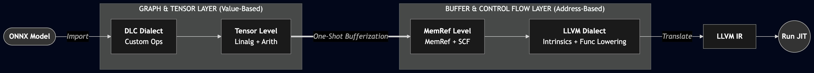
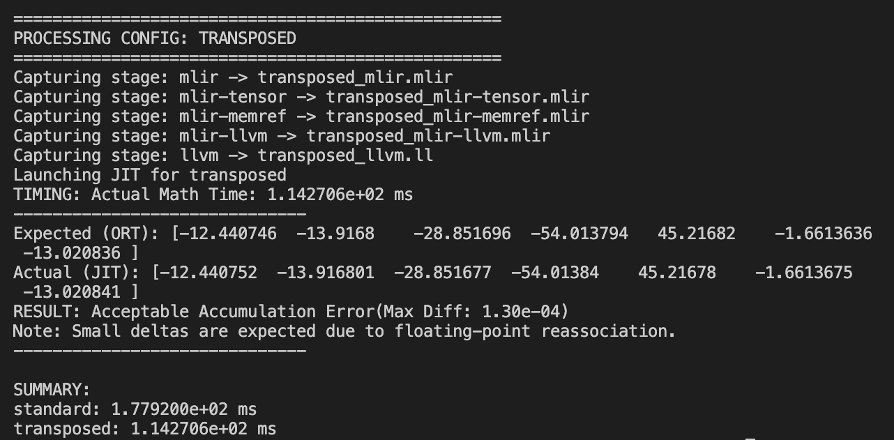
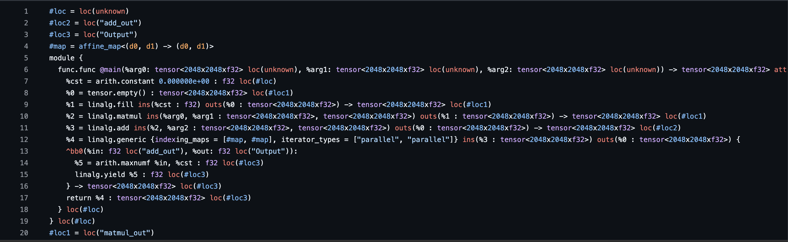
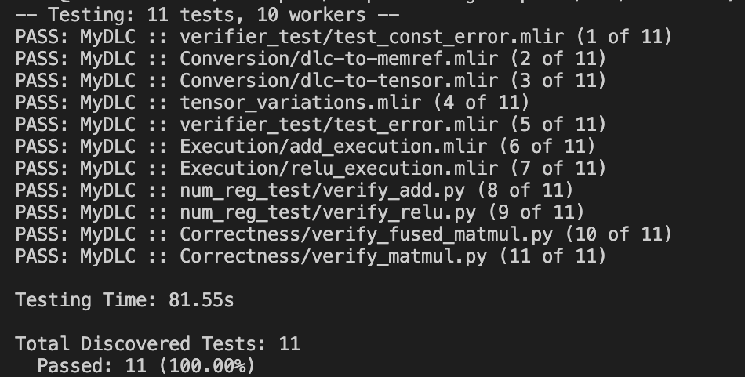
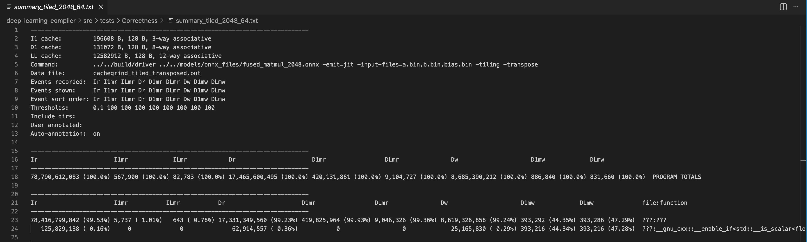
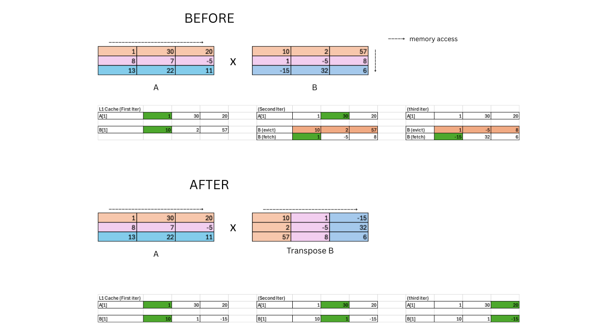
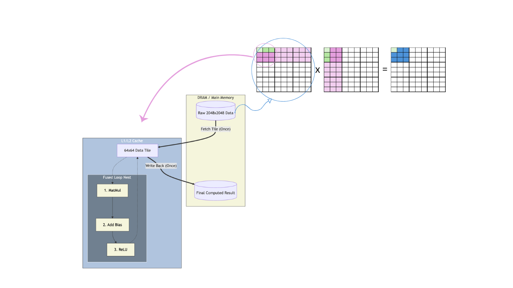

# Tensor Compiler

This is my implementation of a tensor compiler built with MLIR. It supports a subset of ONNX operations (Constant, Add, Relu, and MatMul) and implements a lowering pipeline from an ONNX graph through MLIR to LLVM IR, with execution via JIT compilation. The following highlights the performance of a 2048 x 2048 matrix multiplication workload on an Apple M1 Pro (2021)

| Metric | Naïve / Baseline | Transposed | Transposed + Tiled |
| :--- | :---: | :---: | :---: |
| **Execution Time** | 56.0s | 9.7s | 5.8s |
| **L1 Data Misses** | 8.59B | 273M | 426M |
| **LLC Data Misses** | 8.59B | 273M | 9M |


### Lowering Pipeline
---


The compiler follows a progressive lowering strategy to transform high-level ONNX graphs into LLVM IR. The current scope is focused on the core operations required to execute a Linear Layer (MatMul, add, ReLU, and Constant).

Compilation Flow:
ONNX -> DLC (Custom Dialect) -> Tensor/Linalg -> MemRef -> LLVM IR -> JIT Execution

Key Transformation:
- Frontend: Ingest ONNX models and lowers them into a custom dialect (named dlc)
- Mid-Level: Transitions to the Tensor/Linalg dialect to perform hardware-agnostic optimizations such as Transpose-B for contiguous memory access and Tile-and-Fuse to maximize cache residency
- Backend: Performs Bufferization to map tensors to physical memory (MemRef) before final lowering to the LLVM backend for JIT execution


### Implementation Deep Dive
---
I have written a series of articles on the implementation details of the project available here:
1. [Building my first MLIR-based Tensor Compiler](https://www.joankusuma.com/post/building-my-first-mlir-based-tensor-compiler)
2. [Building a minimal MLIR Pipeline from ONNX to LLVM JIT](https://www.joankusuma.com/post/building-a-minimal-mlir-pipeline-from-onnx-to-llvm-jit)
3. [Implementing Linear Layers and Memory Optimizations on MLIR](https://www.joankusuma.com/post/implementing-linear-layers-and-memory-optimizations-on-mlir)
4. [Performance Analysis and Testing](https://www.joankusuma.com/post/performance-analysis-and-testing)


### Demo Outputs
---
Sample Output when running an ONNX matmul through python script:




Sample IR Output (MLIR's Tensor and Linalg IR):




Sample test output:




Sample Cachegrind output after tiling:




### Optimization and Cache Analysis
---
The performance leap from 56s to 5.8s is primarily driven by optimizing cache locality.




#### Spatial Locality: Transpose-B
In a naïve MatMul, the Right-Hand Side (RHS) matrix is accessed by column. Since memory is row-major, this forces the CPU to fetch a new full cache line for every single floating-point value (evicting useful data before it’s ever used).
By transposing the RHS matrix during lowering to the linalg dialect, the algorithm’s access pattern is aligned with the hardware’s memory layout:
- As in in the “After” visual above, transposing turns vertical column jumps into horizontal row strides
- A single cache fetch now provides multiple subsequent values (highlighted in green), rather than just one
- This transformation reduced L1 Data Misses by 20x




#### Temporal Locality: Tiling
Loop tiling solves temporal locality (reusing data before it is evicted).
- By blocking the workload into smaller register-sized tiles, the working set fits entirely within the processor's caching hierarchy. This keeps the data alive locally for repetitive calculations
- This transformation reduces the Last-Level Cache Misses further by 30x


### Verification and Testing
---
Results are cross-referenced against ONNX Runtime with an absolute tolerance of 1e-3, confirming that the transformations maintain numerical integrity.
To ensure IR correctness and correct error handling, I implemented tests using LLVM Lit and Filecheck


### Codebase Directory
---
```
tensor-compiler
├── src/
│   ├── include/dlc                 # ops.td and header files
│   ├── mlir/                       # lowering passes
│   ├── models/                     # sample onnx models to run
│   ├── parser/                     # load onnx models into structured model info
│   ├── tests/                      # test files
│   ├── CMakeLists.txt
│   └── driver.cpp                  # main entry point compiler driver
├── .gitignore
├── LICENSE
├── Dockerfile
└── README.md
```


### How to run
---
There are multiple ways to run the project, I run this project inside a Docker container. If you already have llvm-project built, you can clone this project and move on to step #1. (make sure that this project is on the same level directory as the llvm-project)

To run with Docker, build with the Dockerfile provided and then clone the project inside the container. I've only built this project on a Macbook M1 Pro so far.

##### Step #1:

Run cmake in tensor-compiler/src:
```
mkdir -p build
cd build
cmake ..
make
```


Accepted Inputs:
```
- ONNX models
- Supported operations: Constant, Add, Relu, MatMul
- Add supports scalar, 1D, and 2D tensors
- MatMul supports 1D and 2D tensors
```


To run: go to tensor-compiler/src/build
```
./driver -emit=<FLAG> path/to/model
# Some examples to get started
./driver -emit=proto ../models/onnx_files/add_constant.onnx
./driver -emit=mlir ../models/onnx_files/add_constant_1.onnx
./driver -emit=mlir-tensor ../models/onnx_files/add_const_init.onnx
./driver ../models/onnx_files/add_const_init.onnx -emit=jit -input-data=5.5,4.5

# available flags:
# proto, mlir, mlir-tensor, mlir-memref, mlir-llvm, llvm, jit
```


You can also use a script to run large matrices, the following python script is available to run MxM matrices:

go to src/tests/Correctness
```
# From the project root:
python3 src/tests/Correctness/verify_matmul.py
```


Testing (run from build dir, make sure to run from the correct dir):
```
../../../llvm-project/build/bin/llvm-lit -v ../tests/
```

Run Valgrind for cache analysis (Running with Valgrind will take longer):
```
# Run inside build dir
valgrind --tool=cachegrind ./driver path/to/model.onnx -emit=jit

# You can also run from the python script: tensor-compiler/src/tests/Correctness/verify_tiled_matmul.py
# Make sure to update the configs based on your processor's cache size
```